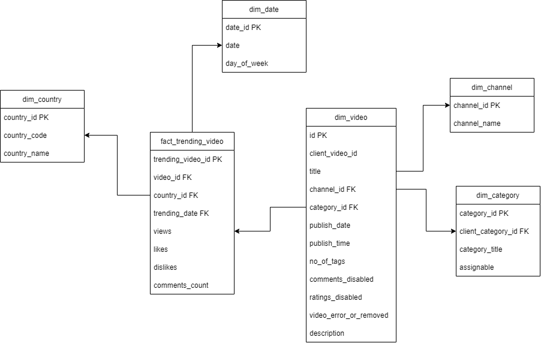

# Requirements Gathering and Modeling for eCommerce
The following is the requirements gathering, conceptual model and physical model of the data warehouse to analyze the trending videos of youtube.

## Requirements Identification
The following requirements were identified:
- To find out the engagements as views, likes, dislikes and comment count on trending videos
- To analyze the trending videos according to the country
- To analyze which category of video is trending on which day of the week
- To analyze youtube channel which has the most trending videos 


## Conceptual Data Modeling

To model the data in a data warehouse, we identify the dimensions table and facts table. We then build a conceptual model using different design schemas. All the steps of conceptual data modeling of the data warehouse are briefly explained hereafter.

#### 1. Identifying Dimensions Table
The following are the dimension tables identified for the data warehouse to analyze the sales:
```dim_country``` - Dimension table containing the list of countries
```dim_date``` - Dimension table containing detailed information about the date that can be published date or trending date 
```dim_channel``` - Dimension table containing information about the channel
```dim_category``` - Dimension table consisting information about the category of the video
```dim_video``` - Dimension table containing the general information about the videos


#### 2. Identifying Facts Table
Similarly after identifying the dimension tables, we now identify the fact tables to create the data warehouse and carry out the analysis. The fact tables identified are:
```fact_trending_video``` - Consists all the records of trending videos and their general information,country, date of publish and trending, and other engagement factors as views, likes, dislikes and comments count. 


#### 3. Identifying the attributes of facts and dimension tables
This step occurs in the logical design modeling phase. But it can be done in conceptual modeling as well. Here, we identify all tha attributes of the entities pre-sepcified (in number 1 and 2 above).

The attributes of the fact and dimension tables can be identified as:

| Table Name | Attributes | 
| :---: | :---: | 
| ```dim_country``` | country_id, country_code, country_name | 
| ```dim_date``` | date_id, date, day_of_week | 
| ```dim_channel``` | channel_id, channel_name | 
| ```dim_category``` | category_id, client_category_id, category_title, assignable | 
| ```dim_video``` | video_id, title, published_date, channel_id, category_id, publish_date, no_of_tags,comments_disabled, ratings_disabled, video_error_or_removal, description | 
| ```fact_trending_video``` | trending_video_id, video_id, country_id, trending_date, views, likes, dislikes, comments_count| 

#### 4. ER Diagram
After we identify the tables abd their attributes, we now create an ER diagram for the data warehouse. Since, we have multiple facts table, our ER diagram would be of Star Schema design which incorporates single facts table.

The proposed ER Diagram of the data warehouse would be:



## Physical Modeling

After conceptual modeling of the system, we now build the physical modeling (or implementation) of the data warehouse. Physical Modeling is done using the postgresql database. All the DDL queries of the physical model of the data warehouse are listed below:

Creating Main schema for data warehouse tables:

Creating Dimension Tables:
```sql
CREATE TABLE dim_channel(
channel_id SERIAL PRIMARY KEY,
channel_name VARCHAR(500)
);
```

```sql
CREATE TABLE dim_country(
    country_id SERIAL PRIMARY KEY,
    country_code VARCHAR(100) UNIQUE,
    country_name VARCHAR(200)
);
```
```sql
CREATE TABLE dim_date(
    date_id SERIAL PRIMARY KEY,
    date   date,
    day_of_week VARCHAR(255)
);
```
```sql
CREATE TABLE dim_category(
    category_id SERIAL PRIMARY KEY,
    client_category_id VARCHAR(200),
    category_title VARCHAR(200),
    assignable BOOLEAN
);
```
```sql
CREATE TABLE dim_video(
    id SERIAL PRIMARY KEY,
	client_video_id	VARCHAR(255),
	title	TEXT,
	channel_id INT,
	category_id INT,
	publish_date INT,
	no_of_tags BIGINT,
    comments_disabled BOOLEAN,
    ratings_disabled BOOLEAN,
    video_error_or_removal BOOLEAN,
    description TEXT
	);
```
Similarly creating Facts Table: 
```sql
CREATE TABLE fact_trending_video(
trending_video_id SERIAL PRIMARY KEY,
video_id INT,
country_id INT,
trending_date INT,
views INT,
likes INT,
dislike INT,
cmt_count INT,
CONSTRAINT fk_video_id FOREIGN KEY (video_id)
REFERENCES dim_videos(video_id) ON DELETE CASCADE,
CONSTRAINT fk_country_id FOREIGN KEY (country_id)
REFERENCES dim_country(country_id) ON DELETE CASCADE,
CONSTRAINT fk_trending_date FOREIGN KEY (trending_date)
REFERENCES dim_date(date_id) ON DELETE CASCADE
);
```
Hence, this document explains the requirements gathering, conceptual model and physical implementation of Youtube Trending Video data warehouse.