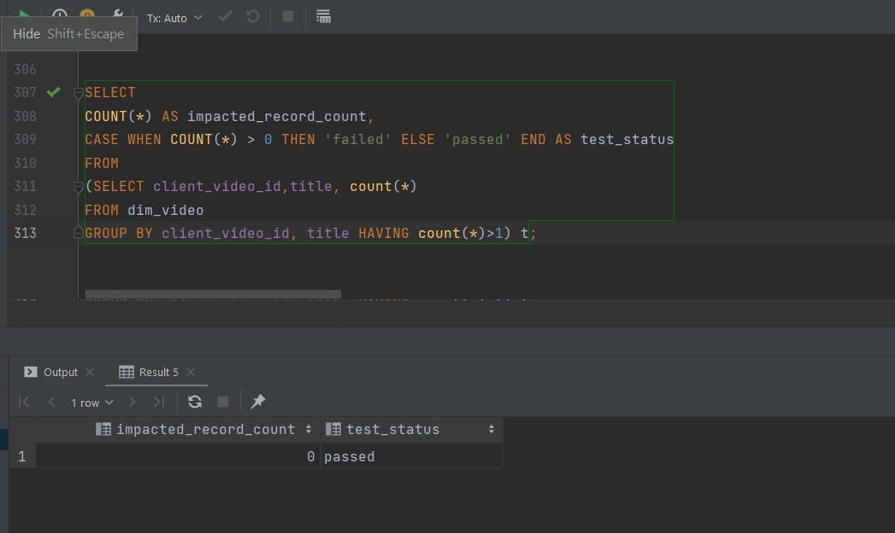

# Query Based Validation 
We now have to validate the database table that is loaded after the ETL process. It is done by writing query based test cases and validating through the database(or say data warehouse).

Some of the validation test cases and their results are listed hereafter.

## Data Validation Queries

#### 1. Check if there is any repetation of video categories in the dim_category table.
```sql
SELECT
COUNT(*) AS impacted_record_count,
CASE WHEN COUNT(*) > 0 THEN 'failed' ELSE 'passed' END AS test_status
FROM
(SELECT category_id, category_title, count(*)
FROM dim_category
GROUP BY category_id, category_title HAVING count(*)>1) t;
```


#### 2. Check if any video information are listed more than once in dim_video table.
```sql
SELECT
COUNT(*) AS impacted_record_count,
CASE WHEN COUNT(*) > 0 THEN 'failed' ELSE 'passed' END AS test_status
FROM
(SELECT client_video_id,title, count(*)
FROM dim_video
GROUP BY client_video_id, title HAVING count(*)>1) t;
```


#### 3. Check if all channel referenced in video records exist.

```sql
SELECT COUNT(*) AS impacted_record_count,
CASE WHEN COUNT(*) > 0 THEN 'failed' ELSE 'passed' END AS test_status
FROM dim_video
WHERE channel_id NOT IN(
    SELECT channel_id from dim_channel
    );
```


#### 4. Check if any video have more dislikes than its views.
```sql
SELECT COUNT(*) AS impacted_record_count,
CASE WHEN COUNT(*) > 0 THEN 'failed' ELSE 'passed' END AS test_status
 FROM fact_trending_video WHERE dislike > views;
```


#### 5. Check if any video having 0 views is listed as trending video.
```sql
SELECT COUNT(*) AS impacted_record_count,
CASE WHEN COUNT(*) > 0 THEN 'failed' ELSE 'passed' END AS test_status
 FROM fact_trending_video WHERE views <= 0;
```


#### In this way, data validation can be done using SQL Queries as test cases.