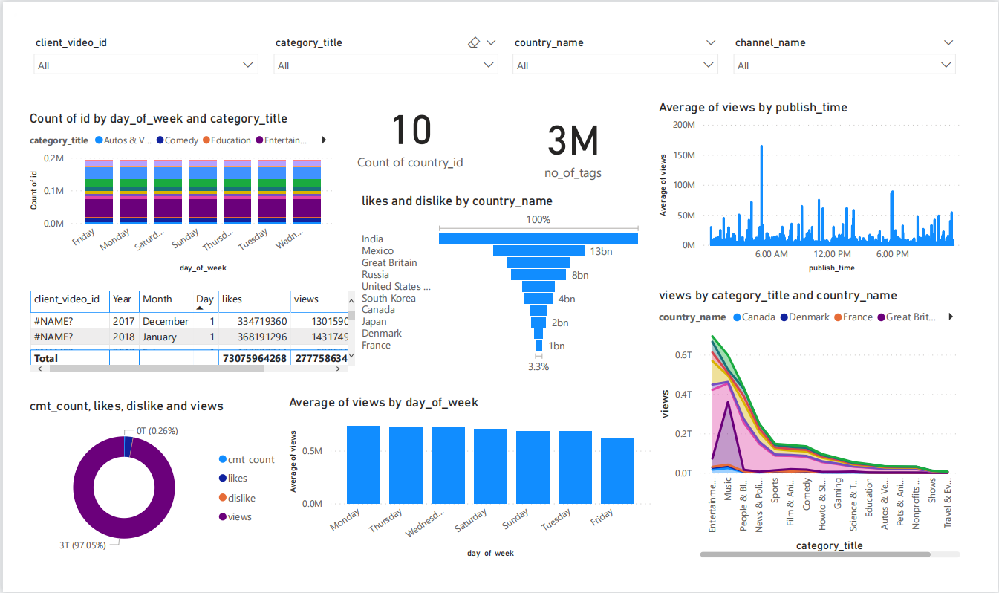

# Data Visualization Using Microsoft PowerBI
After Database design, ETL, Data Warehouse Design and Implementation and Data Validation, we now visualize the data using bars and charts. This is the top most level which represents the data using infographics. 

The following is the Dashboard created for the YouTube Trending Video Analysis using Microsoft Power BI. 

